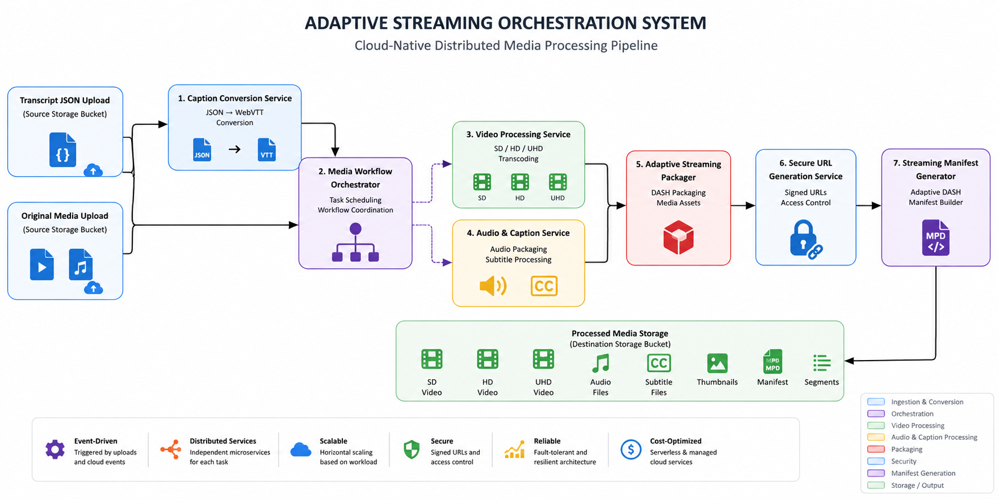

<div align="center">

# Adaptive Streaming Orchestration System

### Event-Driven Media Processing Platform for Video and Audio Workflows

A cloud-native orchestration platform designed to coordinate distributed media processing services for adaptive streaming, audio processing, caption generation, and media asset management.

[]()
[]()
[]()
[]()
[]()
[]()
[]()
[]()
[]()
[]()

</div>


---

# Overview

Adaptive Streaming Orchestration System is a cloud-native media processing platform designed to automate and coordinate complex video and audio workflows through distributed orchestration.

Unlike traditional media pipelines where all processing steps are implemented inside a single monolithic workflow, this platform separates each capability into independent services executed through an orchestration layer.

The system coordinates multiple processing components including:

- Video transcoding
- Audio processing
- Caption generation
- Thumbnail generation
- Metadata extraction
- Streaming packaging
- Quality analysis
- Notification workflows

This architecture improves:

- Scalability
- Maintainability
- Fault isolation
- Service independence
- Deployment flexibility


---

# Motivation

Traditional media processing pipelines often become difficult to maintain as new requirements are added.

A single processing service may contain:

```
Video Processing

+

Audio Processing

+

Subtitle Generation

+

Thumbnail Creation

+

Streaming Packaging

+

Notifications
```

This approach creates:

- Large codebases
- Tight coupling between features
- Difficult deployments
- Limited scalability


The Adaptive Streaming Orchestration System introduces a distributed workflow model:

```
                    Media Input

                         │

                         ▼

                  Orchestration Layer

                         │

        ┌────────────────┼────────────────┐
        │                │                │
        ▼                ▼                ▼

 Video Service     Audio Service    Caption Service

        │                │                │

        └────────────────┼────────────────┘

                         ▼

              Streaming Asset Generation

                         ▼

                 Media Delivery Layer
```

---

# Live Demonstration

<p align="center">
  
</p>


---

# Key Features

## Distributed Media Processing

The platform decomposes media processing capabilities into independent services.

Supported workflows:

- Video transcoding
- Audio extraction
- Audio transformation
- Speech recognition
- Subtitle generation
- Thumbnail creation
- Streaming packaging


---

## Workflow Orchestration

A dedicated orchestration layer manages:

- Task execution order
- Service communication
- Workflow state tracking
- Error handling
- Retry mechanisms
- Processing dependencies


---

## Video Processing

The system supports:

- Multiple video resolutions
- Adaptive streaming preparation
- Media format conversion
- Streaming manifest generation


Generated outputs:

- SD
- HD
- UHD
- DASH Manifest
- Streaming segments


---

## Audio Processing

The platform processes audio independently from video workflows.

Capabilities include:

- Audio extraction
- Audio conversion
- Speech processing preparation
- Independent audio workflow execution


---

## Multilingual Captions

The system integrates speech processing services to generate subtitles.

Supported languages:

- English
- French
- Spanish
- Japanese
- Mandarin Chinese
- Korean


Output format:

```
WebVTT (.vtt)
```


---

# Architecture Overview

<p align="center">
  
</p>


The architecture follows an event-driven orchestration model where each processing capability operates as an independent service.

The orchestration layer coordinates execution while maintaining loose coupling between components.

---

# Core Architecture Principles

## Separation of Responsibilities

Each service owns a specific processing capability.

Example:

```
Transcoding Service

Audio Service

Caption Service

Thumbnail Service

Manifest Service

Notification Service
```

Each component can evolve independently.


---

## Asynchronous Processing

Services communicate through asynchronous events.

Benefits:

- Non-blocking execution
- Better scalability
- Improved resilience
- Independent service scaling


---

## Cloud-Native Design

The platform leverages managed cloud services to provide:

- Automatic scaling
- High availability
- Infrastructure abstraction
- Simplified operations

---

# Detailed Architecture

The Adaptive Streaming Orchestration System is built around a centralized orchestration layer responsible for coordinating independent media processing services.

Instead of executing all operations inside a single application, the system distributes processing responsibilities across specialized services.

```
                         Media Input

                              │

                              ▼

                    Event Ingestion Layer

                              │

                              ▼

                    Orchestration Engine

                              │

        ┌─────────────────────┼─────────────────────┐
        │                     │                     │
        ▼                     ▼                     ▼

 Video Processing       Audio Processing      Caption Processing
 Service                Service               Service


        │                     │                     │

        └─────────────────────┼─────────────────────┘

                              ▼

                    Media Packaging Layer

                              │

                              ▼

                    Streaming Asset Storage

                              │

                              ▼

                    Media Delivery Platform
```

---

# Orchestrator Workflow

The orchestrator acts as the central coordination engine of the platform.

It manages the lifecycle of each media processing workflow from ingestion to final delivery.

## Workflow Execution

```
                 New Media Asset

                        │

                        ▼

              Workflow Initialization

                        │

                        ▼

              Dependency Validation

                        │

        ┌───────────────┼────────────────┐
        │               │                │

        ▼               ▼                ▼

 Video Processing   Audio Processing   Metadata Extraction


        │               │                │

        ▼               ▼                ▼

 Caption Generation   Thumbnail      Quality Analysis


        │               │                │

        └───────────────┼────────────────┘

                        ▼

              Streaming Packaging

                        │

                        ▼

              Workflow Completion

                        │

                        ▼

              Notification Event
```

---

# Orchestrator Responsibilities

The orchestration layer is responsible for:

## Workflow Coordination

- Defining processing execution order
- Managing task dependencies
- Triggering independent services
- Tracking workflow progress


## State Management

The orchestrator maintains workflow states:

```
CREATED

↓

PROCESSING

↓

VIDEO_COMPLETED

↓

AUDIO_COMPLETED

↓

PACKAGING

↓

COMPLETED
```

---

## Error Handling

The orchestration layer provides:

- Service failure detection
- Automatic retries
- Workflow recovery
- Partial execution handling

A failed service does not require restarting the entire pipeline.

---

## Scalability Management

The orchestrator enables:

- Independent service scaling
- Parallel task execution
- Resource optimization
- Distributed workload management

---

# Event Flow

The platform uses an event-driven communication model.

Services communicate through asynchronous events rather than direct dependencies.

```
Media Upload

      │

      ▼

Event Trigger

      │

      ▼

Orchestrator

      │

      ├──────────────► Video Processing Event

      │

      ├──────────────► Audio Processing Event

      │

      ├──────────────► Caption Processing Event

      │

      ├──────────────► Thumbnail Generation Event

      │

      └──────────────► Metadata Processing Event


                     │

                     ▼

              Processing Events

                     │

                     ▼

             Packaging Service

                     │

                     ▼

             Completion Event
```

---

# Event Communication Model

Each service follows an event-based interaction pattern.

Example:

```
Video Service

     publishes

VIDEO_PROCESSING_COMPLETED


          │


          ▼


Orchestrator


          │


          ▼


Trigger next workflow step
```

Benefits:

- Loose coupling
- Independent deployments
- Improved resilience
- Easier service replacement

---

# Services Breakdown

## Orchestrator Service

**Responsibility:**

Central workflow coordination.

Capabilities:

- Workflow management
- Task scheduling
- State tracking
- Retry handling
- Service communication

---

## Video Processing Service

**Responsibility:**

Handles video transformation workflows.

Capabilities:

- Video transcoding
- Resolution generation
- Format conversion
- Streaming preparation

Generated outputs:

```
SD

HD

UHD

Streaming Segments
```

---

## Audio Processing Service

**Responsibility:**

Processes audio independently from video workflows.

Capabilities:

- Audio extraction
- Audio conversion
- Audio normalization
- Speech preparation

---

## Caption Service

**Responsibility:**

Generates multilingual subtitle files.

Capabilities:

- Speech recognition
- Language processing
- Subtitle generation

Output:

```
WebVTT (.vtt)
```

Supported languages:

```
English
French
Spanish
Japanese
Mandarin Chinese
Korean
```

---

## Thumbnail Service

**Responsibility:**

Creates visual previews from media content.

Capabilities:

- Frame extraction
- Thumbnail generation
- Preview asset creation

---

## Manifest Packaging Service

**Responsibility:**

Creates streaming-ready delivery assets.

Capabilities:

- DASH manifest generation
- Media packaging
- Stream organization

---

## Notification Service

**Responsibility:**

Communicates workflow completion.

Capabilities:

- Status notifications
- Event publishing
- External system integration

---

# Technical Stack

## Programming Languages

- Python
- Bash

---

## Backend Frameworks

- FastAPI
- REST APIs
- Async Programming

---

## Cloud Platform

Google Cloud Platform:

- Cloud Run
- Cloud Functions
- Cloud Storage
- Pub/Sub
- Eventarc
- Transcoder API
- Speech-to-Text API

---

## Containerization & Infrastructure

- Docker
- Kubernetes
- Google Kubernetes Engine (GKE)
- Linux environments

---

## Media Processing

- FFmpeg
- MPEG-DASH
- WebVTT
- Adaptive Bitrate Streaming

---

## Architecture Patterns

- Event-Driven Architecture
- Microservices Architecture
- Workflow Orchestration
- Distributed Systems
- Asynchronous Processing

---

# Repository Structure

```
adaptive-streaming-orchestration-system/

│
├── assets/
│   ├── Orchestration-vod-pipeline-demo.gif
│   ├── Orchestration-vod-complet.png
│   
│
├── docs/
│   ├── architecture.md
│   ├── deployment.md
│   ├── orchestration.md
│ 
│
├── services/
│
│   ├── orchestrator/
│   │   ├── main.py
│   │   └── workflow.py
│
│   ├── video-processing/
│   │   └── transcoder.py
│
│   ├── audio-processing/
│   │   └── audio_service.py
│
│   ├── caption-service/
│   │   └── caption_generator.py
│
│   ├── thumbnail-service/
│   │   └── thumbnail_generator.py
│
│   ├── manifest-service/
│   │   └── packaging.py
│
│   └── notification-service/
│       └── notifier.py
│
│
├── Dockerfile
├── requirements.txt
├── README.md
└── LICENSE
```

---

# Design Benefits

This architecture provides:

- Independent service evolution
- Better maintainability
- Fault isolation
- Parallel processing
- Flexible deployment
- Improved scalability
- Easier integration of new media capabilities

---

# Deployment

The Adaptive Streaming Orchestration System is deployed using a cloud-native architecture based on Google Cloud Platform.

The platform uses independent services that are deployed and scaled separately according to workload requirements.

---

## Deployment Workflow

```
Developer
    │
    ▼
Source Repository
    │
    ▼
Container Build
    │
    ▼
Container Registry
    │
    ▼
Cloud Run Services

        +
        
Cloud Functions

        +

Event-Driven Messaging Layer
```

---

## Deployment Process

1. Build container images for individual services

2. Deploy processing services independently

3. Configure Cloud Storage event triggers

4. Configure Pub/Sub communication channels

5. Deploy orchestration workflows

6. Validate service-to-service communication

7. Execute end-to-end media processing tests

---

## Runtime Architecture

The platform runs multiple independent services:

```
                    Orchestrator

                         │

        ┌────────────────┼────────────────┐

        ▼                ▼                ▼

 Video Service    Audio Service    Caption Service

        │                │                │

        ▼                ▼                ▼

 Transcoding     Audio Analysis    Speech Processing


        └────────────────┬────────────────┘

                         ▼

              Streaming Asset Generator

                         │

                         ▼

                  Output Storage
```

---

# Metrics

The system was designed to improve scalability, maintainability, and processing flexibility compared with a monolithic media pipeline.

<div align="center">

| Metric | Value |
|--------|------:|
| Processing Services | 7+ independent services |
| Media Types Supported | Video and Audio |
| Architecture Style | Event-Driven Orchestration |
| Streaming Formats | DASH / Adaptive Streaming |
| Deployment Model | Cloud-Native Serverless |
| Processing Workflows | Asynchronous Execution |
| Cloud Services Integrated | 8+ |

</div>

---

# Engineering Challenges

## 1. Migrating from Monolithic Processing to Orchestration

### Challenge

A traditional media pipeline executes multiple processing steps inside a single application, creating tight coupling and limiting scalability.

### Solution

Designed an orchestration-based architecture where each processing capability is isolated into independent services.

Benefits:

- Better maintainability
- Independent deployments
- Easier debugging
- Improved scalability

---

## 2. Coordinating Distributed Media Services

### Challenge

Multiple services must execute in the correct order while handling failures independently.

### Solution

Implemented event-driven communication patterns using cloud messaging services.

The orchestrator manages:

- Workflow execution
- Service coordination
- Processing state
- Error handling
- Task dependencies

---

## 3. Supporting Both Video and Audio Workflows

### Challenge

Media processing requirements differ between video and audio assets.

### Solution

Separated media processing responsibilities into specialized services:

- Video transcoding service
- Audio processing service
- Caption generation service
- Streaming packaging service

This enables future extensions without modifying the entire system.

---

## 4. Building a Scalable Processing Architecture

### Challenge

Large media workloads require flexible resource allocation.

### Solution

Used containerized services with independent scaling capabilities.

The architecture supports:

- Parallel execution
- Workload isolation
- Horizontal scaling
- Cloud-native deployment

---

# Future Improvements

Potential improvements include:

## Infrastructure

- Infrastructure as Code using Terraform

- Automated CI/CD pipelines

- Multi-region deployment

- Disaster recovery strategy

---

## Media Processing

- HLS packaging support

- Advanced adaptive bitrate optimization

- AI-powered video analysis

- Automatic scene detection

- Video quality assessment

---

## AI Capabilities

- Automatic content summarization

- Object detection

- Smart metadata extraction

- Semantic search over media content

- AI-generated highlights

---

## Platform Improvements

- Workflow monitoring dashboard

- Real-time processing analytics

- Advanced retry mechanisms

- Processing cost optimization

- User-facing API gateway

---

# Documentation

Detailed technical documentation is available in the `docs/` directory.

| Document | Description |
|----------|-------------|
| `architecture.md` | System architecture and service interactions |
| `deployment.md` | Cloud deployment strategy |
| `workflow.md` | End-to-end processing workflow |
| `orchestration.md` | Workflow orchestration design |

---

# Repository Structure

```
adaptive-streaming-orchestration-system/

│
├── assets/
│   ├── demo.gif
│   ├── architecture.png
│   └── workflow.png
│
├── docs/
│   ├── architecture.md
│   ├── deployment.md
│   ├── workflow.md
│   └── orchestration.md
│
├── services/
│   ├── orchestrator/
│   ├── video-processing/
│   ├── audio-processing/
│   ├── caption-service/
│   ├── thumbnail-service/
│   └── streaming-service/
│
├── Dockerfile
├── requirements.txt
├── README.md
└── LICENSE
```

---

# License

This project is released under the MIT License.

The MIT License allows this project to be:

- Used commercially
- Modified
- Distributed
- Integrated into other applications

See the `LICENSE` file for additional details.

---

# Author

**Arielle Sedoine Mogoung Notouom**

Cloud Software Engineer

GitHub:
https://github.com/ArielleSedoine

LinkedIn:
https://www.linkedin.com/in/arielle-60178832a/

---

<div align="center">

⭐ If this project helped you understand cloud-native media orchestration, consider giving it a star.

</div>
